# 仓库下载、环境配置与网站预览完整指南
该文档将分步骤说明如何从代码仓库下载项目、配置运行环境，并最终预览网站效果。

## 准备工具
确保已安装： 

PyCharm专业版、Node.js(18.0版本及以上)

## Node.js安装步骤
### 1.下载node.js  

下载地址：https://nodejs.org/zh-cn/download/ 
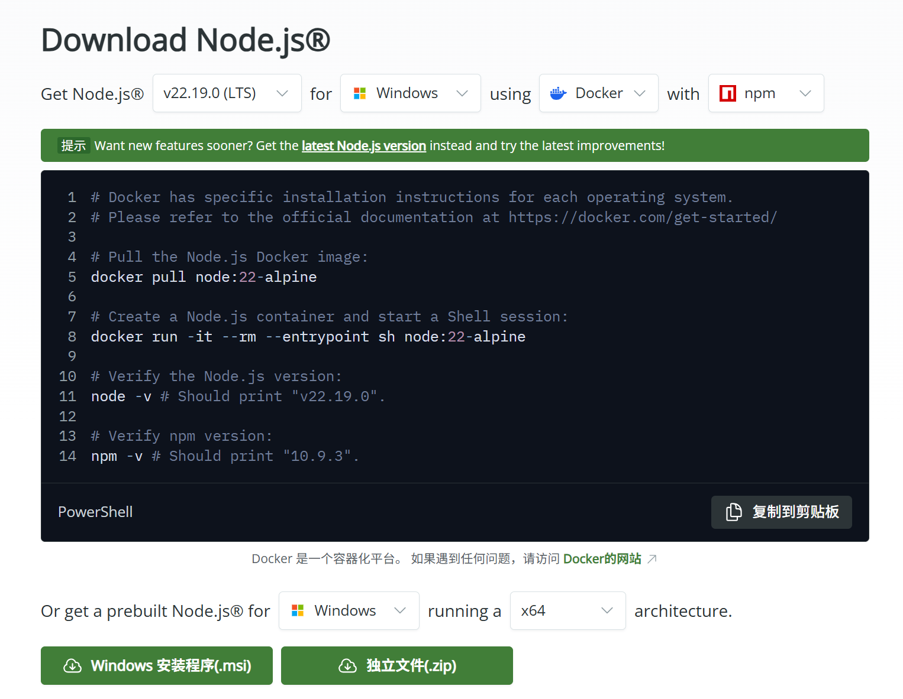 

如图选择.msi安装（windows） 
***
### 2.安装
#### 2.1  完成软件安装（自定义路径）
下图根据本身的需要进行，我选择了默认Node.js runtime，然后Next一直到完成安装（不需要安装额外插件）： 

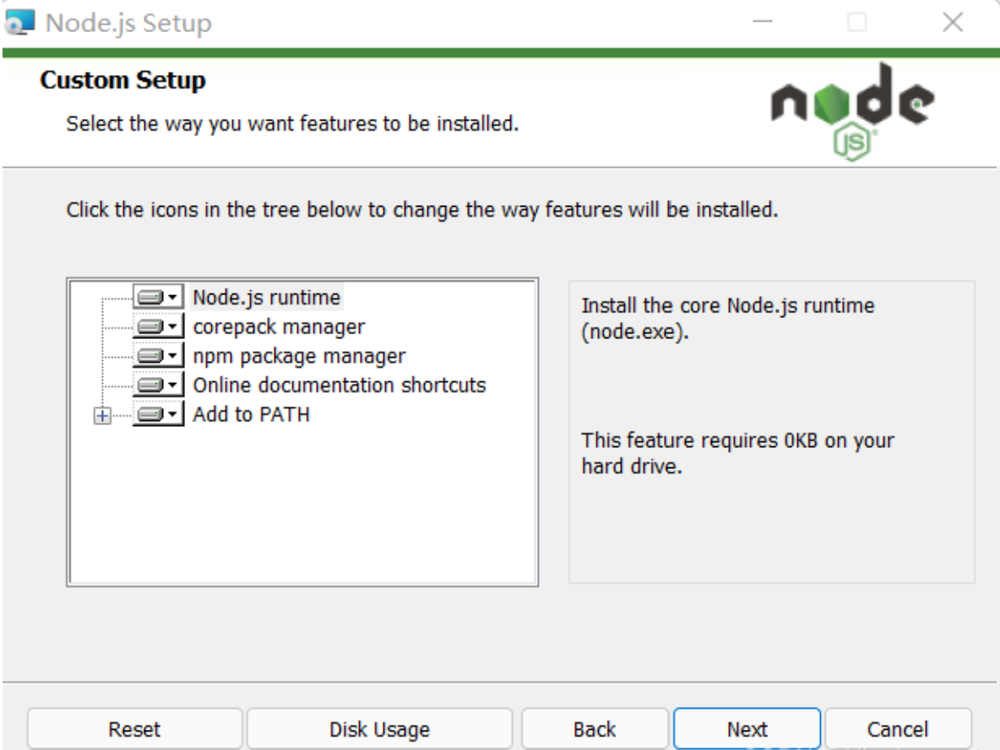 

Node.js runtime ：表示运行环境 

npm package manager：表示npm包管理器 

online documentation shortcuts ：在线文档快捷方式 

Add to PATH：添加到环境变量 

测试安装是否成功，按下【win+R】键，输入cmd，打开cmd窗口 

**输入** 

```
node -v     // 显示node.js版本

npm -v      // 显示npm版本 
```
输出应该如下图： 

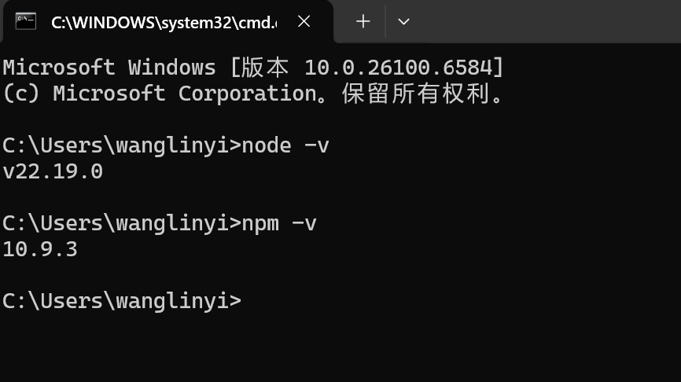 

出现node、npm的版本号即说明安装成功。 


***
#### 2.2.环境变量配置 
找到刚刚安装的目录，在安装目录下新建两个文件夹【node_global】和【node_cache】 

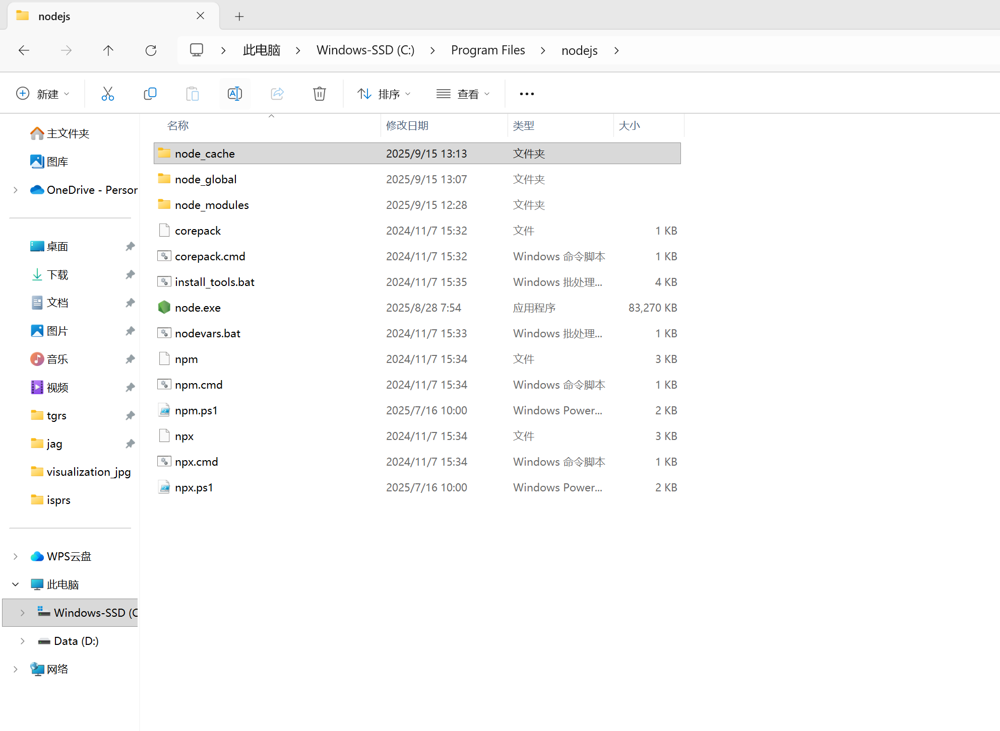  

创建完毕后，复制刚刚创建的【node_global】和【node_cache】文件夹路径在cmd命令分别输入以下两条命令，注意不要两条命令的文件路径不要搞混。

注：可以打开所创建的文件夹，把鼠标放在箭头指向的位置选择复制。 
使用管理员身份打开cmd命令窗口，输入以下命令：
```
npm config set prefix "你的安装地址\Nodejs\node_global" 
npm config set prefix "你的安装地址\Nodejs\node_global"


```
正式配置环境变量： 
【此电脑】-单击右键-【属性】-【高级系统设置】-【环境变量】 

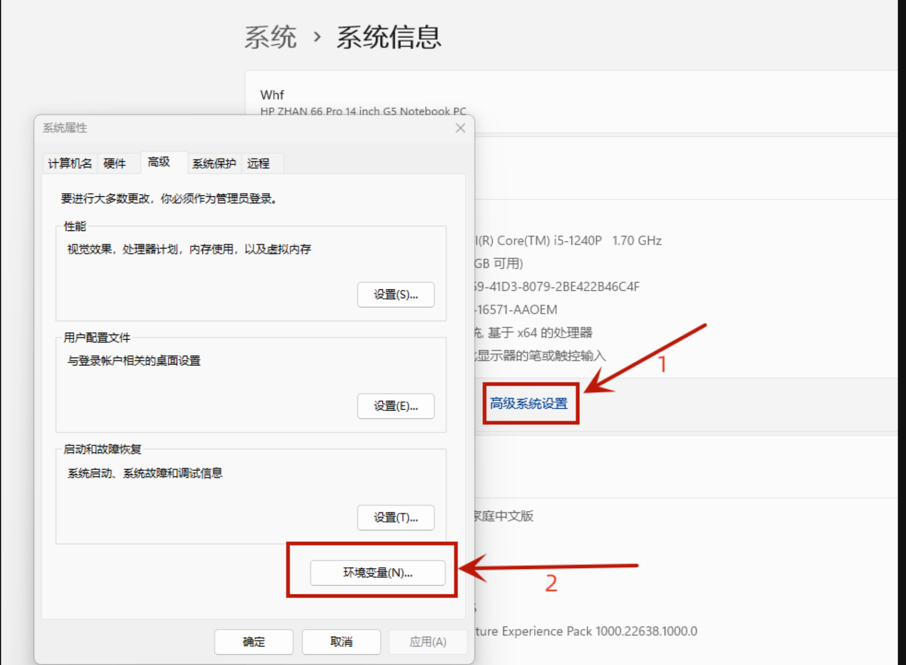  
在【系统变量】中点击【新建】，设置变量名为NODE_PATH，变量值为变量值：你的地址\Nodejs\node_global\node_modules  

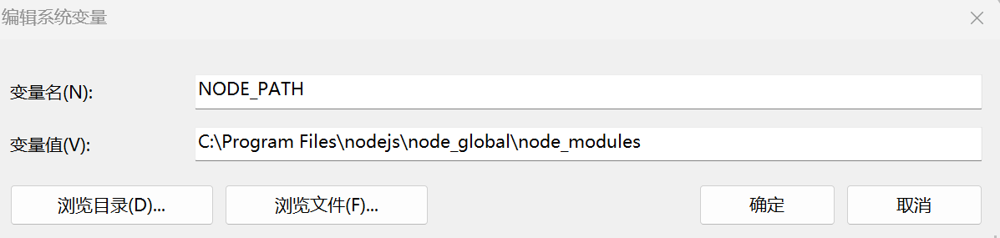  

编辑【用户变量】中的【Path】 

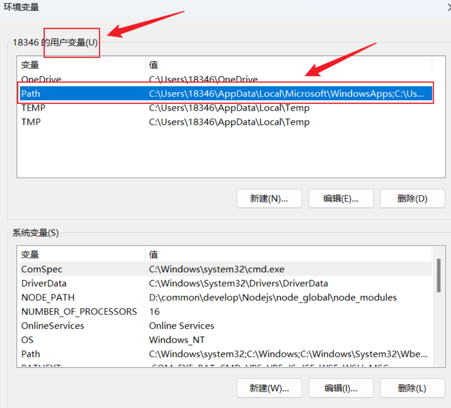  

将默认的 C 盘下【AppData\Roaming\npm】修改成 【node_global】的路径，点击【确定】 

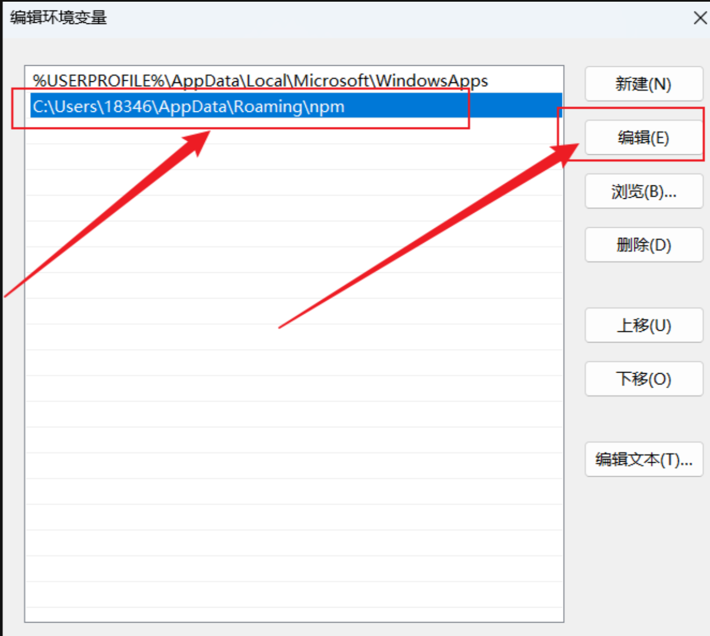  

在【系统变量】中选择【Path】点击【编辑】后点击新建【%NODE_PATH%】，随后一直点击【确定】直到关闭所有窗口即可。 

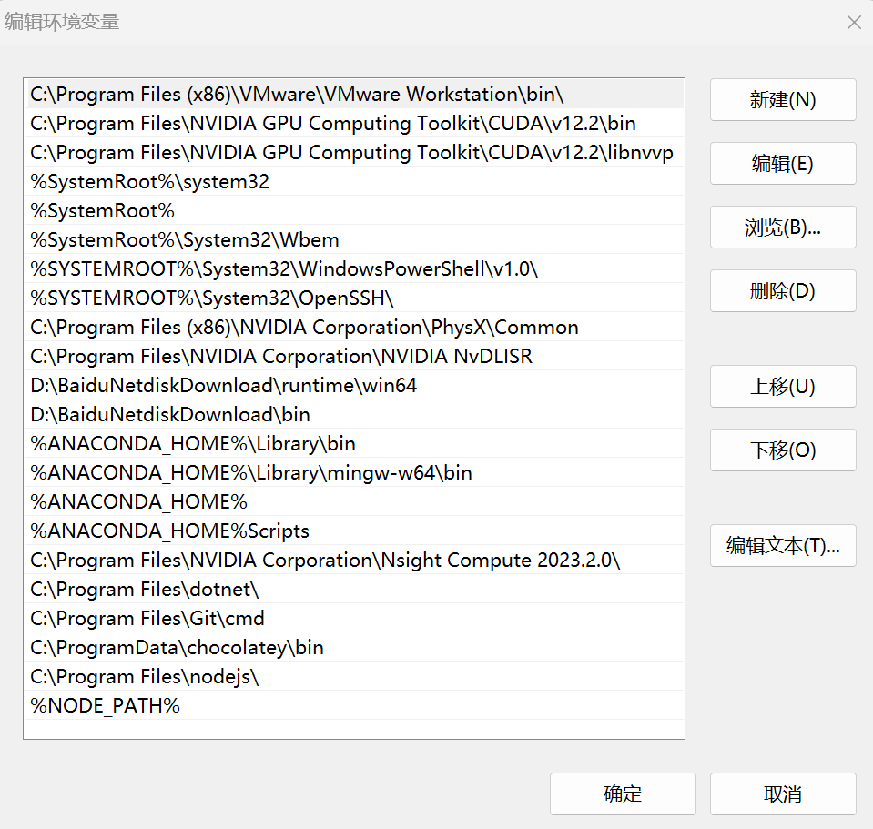  

***

### 3.测试 
  配置完成后，全局安装一个最常用的 express 模块进行测试（使用管理员方式打开cmd）
```
npm install express -g    

```
出现以下界面即为配置成功:  

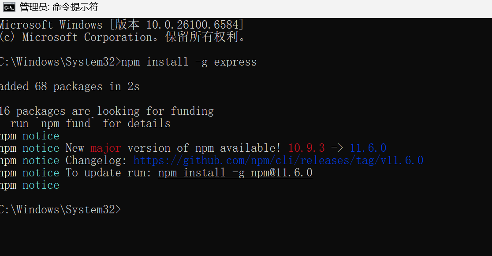  

***
## 在 PyCharm 中下载（克隆）仓库并预览网站
### 1.打开 PyCharm 并启动克隆功能 
打开 PyCharm，在顶部菜单点击 文件 > VCS > Get from Version Control 

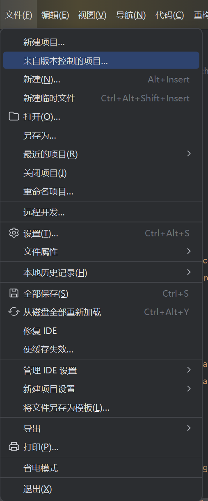  

配置仓库克隆参数:在弹出的窗口中：
Version control 选择 Git 

URL 输入仓库地址：https://github.com/shinyypig/BeautyofMatrix.git 

Directory 选择本地存放路径（如 C:\Users\你的用户名\PycharmProjects\BeautyofMatrix） 点击 Clone 开始克隆。 

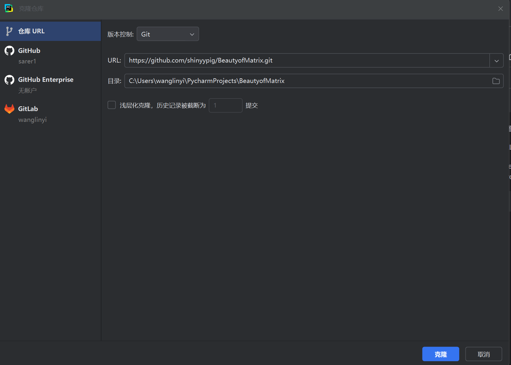  

确认克隆成功，克隆完成后，PyCharm 会自动打开项目，左侧 Project 面板可看到仓库文件（docs 目录、package.json 等）。 

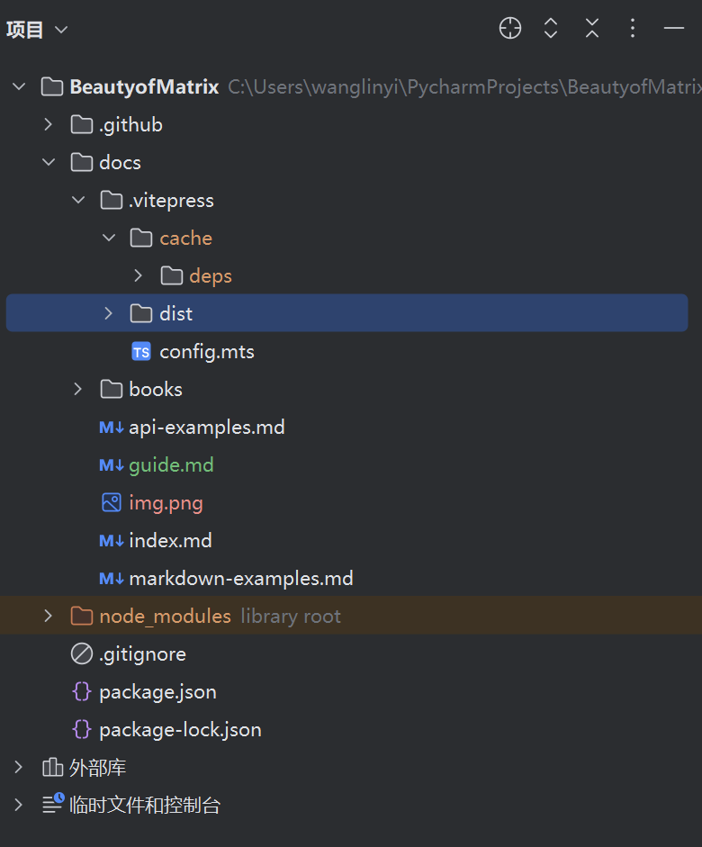  
***
### 2.在 PyCharm 中配置开发环境 

配置 Node.js 解释器（确保 PyCharm 识别 npm）: 

打开 File > Settings > Languages & Frameworks > Node.js
点击 Node interpreter，选择本地已安装的 Node.js 路径（如 C:\Program Files\nodejs\node.exe）
点击 OK 保存，下方会显示项目依赖列表（若为空，后续安装后会自动刷新）。  

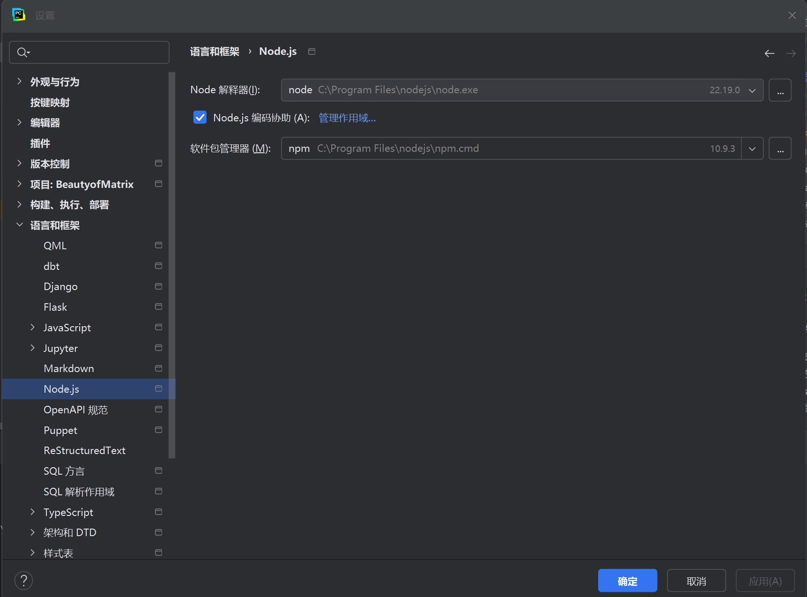  

打开 PyCharm 内置终端:
点击底部状态栏的 Terminal（或 View > Tool Windows > Terminal），终端会自动进入项目根目录。

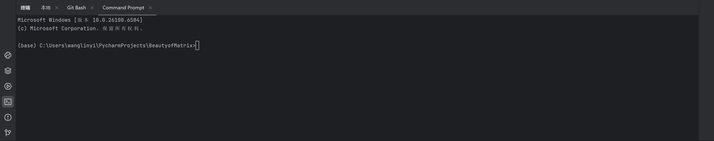 

安装项目依赖:在终端中执行安装命令（若遇权限错误，右键终端标题栏选择 “以管理员身份重启”）
```
npm install
```
安装成功后应该显示： 

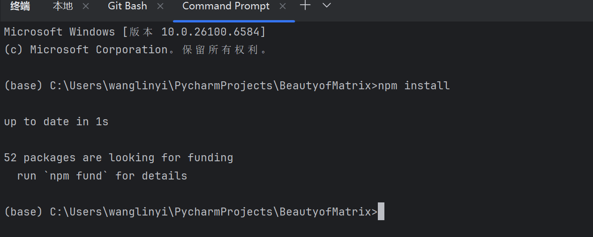  

***
### 3.在 PyCharm 中预览网站 

启动 VitePress 开发服务器:在内置终端中执行预览命令 
```
npm run docs:dev
```
启动成功后，终端会显示本地访问地址 

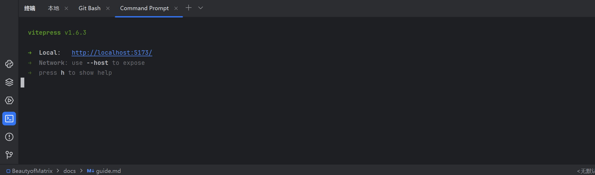  

在 PyCharm 中打开预览:点击终端中的地址，或手动复制到浏览器打开。
网站会实时响应文件修改（如编辑 docs/index.md 后，浏览器自动刷新）  

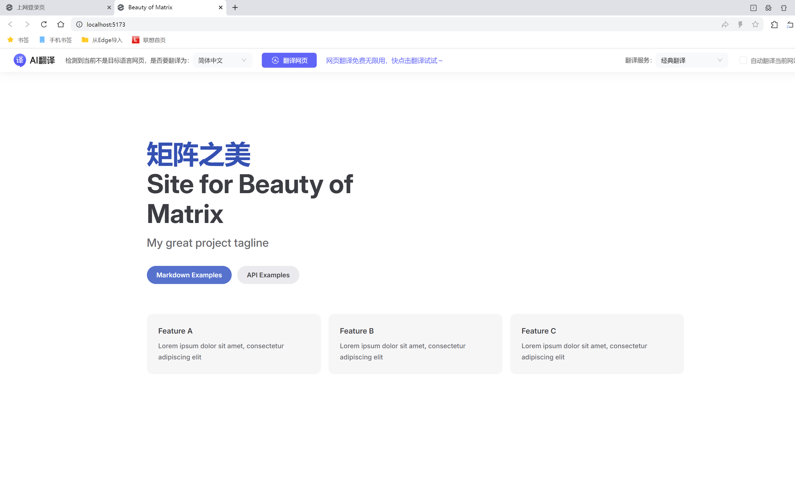  

利用 PyCharm 实时编辑功能: 在左侧项目面板打开任意 Markdown 文件（如 docs/index.md）
右键编辑区选择 Show Preview（或点击右上角预览图标），可在 PyCharm 内实时查看 Markdown 渲染效果。

***

## 项目构建与部署
完成Markdown内容编写后，需构建为静态文件并部署（以 GitHub Pages 为例）
### 1.构建静态文件
执行命令生成可部署的 HTML/CSS/JS
```
npm run docs:build  # 等价于 vitepress build docs
```
产物位于 docs/.vitepress/dist 目录。 

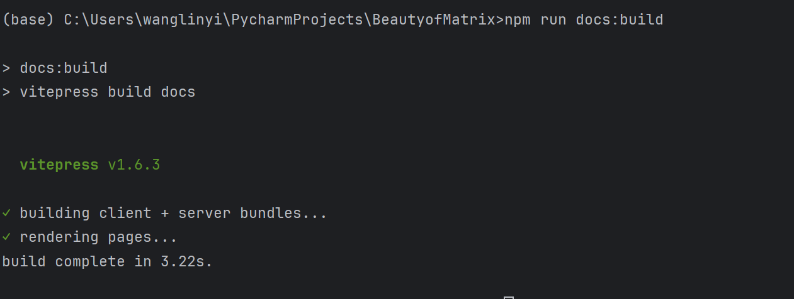  

### 2.部署到 GitHub Pages
通过 GitHub Actions 自动部署（项目已包含 .github/workflows/deploy.yml 配置）： 

```
git add .
git commit -m "更新文档"
git push
``` 

仓库页面 → Actions 可查看部署进度，完成后访问 https:/用户名.github.io/BeautyofMatrix/。

### 3.如何通过复刻（Fork）参与 GitHub 项目
#### 什么是复刻（Fork）？
复刻（Fork）是 GitHub 提供的一种功能，允许你创建一个项目的个人副本。通过复刻，你可以自由修改代码而不影响原项目，之后还能通过 Pull Request 将你的修改提交给原项目维护者，成为项目贡献者。

#### 如何参与？
复刻目标项目
打开你想要参与的 GitHub 项目主页（https://github.com/shinyypig/BeautyofMatrix） 
点击页面右上角的Fork按钮 

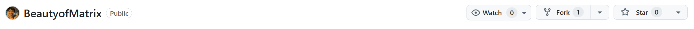

等待几秒钟，GitHub 会为你创建该项目的复刻版本，地址通常为https://github.com/你的用户名/repository 

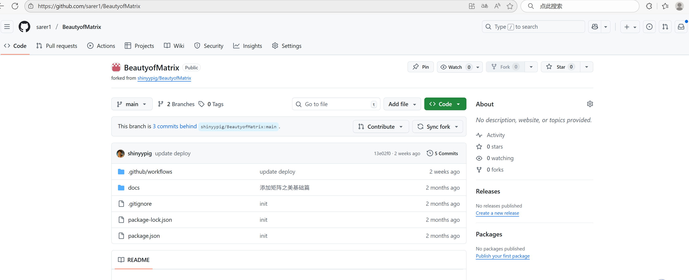 

将复刻仓库克隆到本地： 

使用git clone命令将你的复刻仓库下载到本地计算机： 
```
git clone https://github.com/你的用户名/repository.git
cd  repository  //repository改为你创建的复刻项目名
``` 

为了保持你的复刻仓库与原项目同步，需要添加原仓库作为上游（upstream）： 
```
# 添加上游仓库
git remote add upstream https://github.com/username/original-repository.git

# 验证配置是否成功
git remote -v
``` 
成功后会显示类似以下内容： 
```
origin  https://github.com/你的用户名/repository.git (fetch)
origin  https://github.com/你的用户名/repository.git (push)
upstream        https://github.com/username/original-repository.git (fetch)
upstream        https://github.com/username/original-repository.git (push)
```
为了避免直接在主分支（通常是main或master）上修改，建议创建一个新分支：
```
# 确保你的主分支是最新的
git checkout main
git pull upstream main

# 创建并切换到新分支
git checkout -b feature/your-feature-name
``` 
分支命名建议： 

• 新功能：feature/功能名称 

• 修复 bug：bugfix/问题描述 

• 文档更新：docs/文档名称 

#### 如何从分支修改到对矩阵之美项目修改
首先将修改推送到复刻仓库： 
```
# 添加修改的文件
git add 文件名1 文件名2 ...
# 或添加所有修改
git add .

# 提交修改，填写有意义的提交信息
git commit -m "简要描述你的修改：例如 修复了登录页面的样式问题" 

#推送到你的复刻仓库
git push origin feature/your-feature-name
``` 
然后向项目管理员创建PR，打开你的复刻仓库页面（https://github.com/你的用户名/repository）
回到线上派生项目的工作区，会看到新分支和修改的合并提交信息，和一个 "Compare & pull request" 的按钮： 

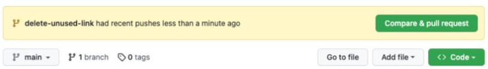 
在打开的页面中：
填写标题（简洁描述你的修改） 

填写详细描述（说明你修改了什么，为什么这样修改） 

确保基础分支是原项目的主分支，比较分支是你创建的新分支 

点击 "Create pull request" 按钮即可。 
***
### 保持复刻仓库同步
建议定期同步原项目的更新，避免你的修改与原项目产生冲突： 

```
# 切换到主分支
git checkout main

# 拉取原项目的最新代码
git pull upstream main

# 推送到你的复刻仓库
git push origin main
```