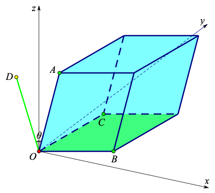

# 矩阵之美

## 第 1 节｜黑匣子、图景与天梯

> ——从抽象工具到物理真理的三重境界

对矩阵的认识大致经历了三个阶段：首先，矩阵是一种新的数学符号或者代数工具，它有各种不知来由的定义和不知所谓的代数性质。在此阶段，矩阵就像一个黑匣子，抽象而晦涩。其次，矩阵是线性变换在给定坐标系下的代数表达，它可以表征自然界中的各种线性动作。在此阶段，矩阵就像一幅图景，具体而清晰。最后，矩阵具有深刻的物理内涵，各种不同的矩阵代数结构对应着自然界中各种不同的物理结构。在此阶段，矩阵就像一架通往终极真理的天梯，美妙而神秘。

## 第 2 节｜矩阵的起源

> ——线性空间与线性变换的抽象约定

凯莱是公认的矩阵论奠基人，但"Matrix"一词最早由西尔维斯特创造，而其中文翻译“矩阵”的来源至今仍无确凿考证。接下来，我们将探讨矩阵诞生的基本逻辑。

矩阵的诞生代数上源自两个基本的数学概念：线性空间和线性变换。这两个概念实际上都是我们现实世界的抽象的代数总结。线性空间可以视为人类对所生存的三维空间的抽象的代数描述，而线性变换则是对三维空间中众多基本线性过程的抽象的代数表达。事实上，线性变换广泛存在于自然界中。无论是热的传导、光的传播，还是力的作用、人的感知，从宏观的天体运动到微观的粒子世界，都充满了大量的线性过程。一定程度而言，线性代数这门学科，正是为了描述、理解这些自然现象而生的。

可以证明，在给定一组基的情况下，有限维线性空间上的任何线性变换都唯一对应一个矩阵。用精确的数学语言来说，矩阵是有限维线性空间上的自同态映射在一组基下的数字表达。因此，从某种意义上讲，矩阵不仅仅是一个抽象的符号，它更是描述现实世界中线性过程的基本工具。任何对矩阵的研究，都不能脱离现实世界，而必须根植于它所对应的实际线性过程。在实际应用中，只有真正理解了矩阵所对应的几何或物理内涵，才能在研究中随心所欲，有的放矢。

  
   图1. 在给定一组基底的情况下，有限维线性空间上任意的线性变换都可以由矩阵定量表达。本图所示的线性变换为水平方向拉伸，垂直方向压缩的挤压变换（绿色图形为原图，蓝色图形为变换后的形状）。值得注意的是，同一个线性变换在不同坐标系下对应的矩阵不同但相似，即相似的矩阵背后都对应同一与坐标无关的线性变换 
  

## 第 3 节｜特征值与特征向量

> ——线性动作的解构语言

前面我们提到，任意有限维空间中的线性变换都可以用矩阵来表示。那么，自然而然地就会提出一个问题：给定一个矩阵，它对应的线性变换究竟是什么？或者说，它具体包含了哪些基本的线性动作？矩阵的特征值与特征向量正是解开这个谜底的关键所在。

事实上，矩阵的特征值和特征向量共同构成了一个基本的线性动作。当矩阵具有实特征值时，说明矩阵对应的线性变换在相应的特征向量方向具有缩放作用，特征值的大小即为缩放倍数；当特征值为负数时，矩阵所对应的线性变换在相应的特征向量方向还包含反射动作。而当矩阵具有复特征值时，则表明矩阵对应的线性变换必然包含一个旋转的动作。我们知道，旋转有两个重要的指标：旋转角度和旋转场所（即旋转动作所在的子空间）。那么这两个重要指标跟矩阵的特征值与特征向量之间有什么关联么？答案是肯定的！旋转角度恰好与矩阵特征值的幅角对应，而旋转场所正是相应的复特征向量的实部和虚部所张成的平面。

因此，对于一个可对角化的矩阵，我们可以将其与上述基本的线性动作相对应。每个基本的线性动作都由相应的特征值和特征向量共同表征。特征值决定了矩阵包含何种类型的线性动作，而特征向量则表明这些线性动作具体发生在什么地方（某个方向或平面）。

  
   图2. 矩阵的特征值与特征向量的几何含义。当矩阵的特征值为实数时，特征向量为矩阵算子的不变方向，
  而特征值为相应特征向量方向的缩放度（绿色图形为原图，蓝色图形为矩阵作用后的结果）

  
   图3. 矩阵的特征值与特征向量的几何含义。当矩阵的特征值为复数时，特征值与对应特征向量必然共轭成对，
  几何上对应旋转，旋转所在平面由特征向量的实部和虚部张成，辐角为旋转角度

## 第 4 节｜若尔当标准型与剪切动作

> ——不可对角化矩阵背后的特殊动作

上节讲到，对于可对角化的实矩阵，其对应的线性基本动作只可能是缩放（包含反射）和旋转。那么，除此之外，还有别的基本线性动作么？或者说，是否存在不能被可对角化矩阵表示的线性动作呢？矩阵的若尔当标准型理论为这一问题的解答提供了根本性的理论保障。

事实上，并不是所有的矩阵都可对角化。代数上，当一个矩阵特征根的代数重数大于几何重数时，该矩阵就不可对角化。对于不可对角化的矩阵，一个自然而然的问题就是，它究竟还包含了何种基本线性动作？伟大的数学家若尔当告诉我们，对于所有不可对角化的矩阵，都可以将其简化为若尔当标准型！而若尔当块及其广义特征向量共同构成了一个基本的线性动作——剪切。

若尔当标准型理论明确地告诉我们，自然界中的各种线性动作种类繁多、形态各异，但其基本类型无外乎三种类型：缩放（包括反射）、旋转和剪切！除此之外，再无其他！

矩阵之美，不仅在于它可以精确表达自然界中的各种线性变换，更在于它清晰地揭示了这些变换背后所蕴含的自然界的基本秩序与结构。

  
   图4. 当一个实方阵不能被对角化，说明它对应的线性变换必然包含剪切变换（绿色图形为原图，蓝色图形为某一不能被对角化的矩阵作用之后的结果） 

## 第 5 节｜数理同契

> ——数系演化与物理动作的契合之谜

克罗内克有句著名的论断：“上帝创造了自然数，其他皆为人造。”尽管这句话的严谨性和真实性存在争议。但我们确实可以将其他标准数系（整数、有理数、实数和复数）视作自然数在不同意义上的完备化。比如：整数是自然数的加法完备化（整数集是包含自然数的最小加法群）。有理数是整数的乘法完备化（有理数域是包含整数的最小数域）。实数是有理数的度量完备化（实数域是包含有理数域的最小度量完备空间）。复数是实数的代数完备化（复数域是实数域的最小代数闭域）。

从基本线性动作的角度来看，从自然数到整数的拓展（引入负数），人类首次能够用数来描述反射这种动作；从整数到有理数的拓展，人类曾一度认为可以用数描述任意的长度；从有理数到实数的拓展，人类才真正可以用数描述任意程度的缩放动作，为此，希伯斯甚至还付出了生命的代价；而从实数到复数的拓展，人类才拥有了用数来描述任意角度旋转动作的能力。

由此可以看出，基本数系与自然界中的基本物理动作竟然如此契合！而无论是高斯的代数学基本定理，还是魏尔斯特拉斯等数学家的严格证明，均表明没有比复数域更一般的数域了。那么，与此对应，这是否意味着，自然界中没有比旋转更基本的线性动作了呢？也就是说，旋转极有可能正是我们所生存的这个宇宙的基本旋律！

  
   图5. 数理同契示意图 

## 第 6 节｜赝角度的提出

> ——当幅角不再等于旋转角，几何真像何在？

我们在前面讲到，当矩阵包含复特征值时，代表其对应的线性变换必然包含旋转的动作，并且这个动作发生在相应的复特征向量的实部和虚部张成的平面上，而旋转角度恰好与特征值的幅角对应。事实上，这一说法在很多情况下并不严谨，甚至不成立！

当复特征向量的实部和虚部两个向量可以等效为标准正交基的时候，特征值的幅角确实与该平面上真实的旋转角度严格对应。但如果这两个向量不正交，或者不等长，那么特征值的幅角就无法简单地对应该平面上的旋转角度。事实上，在这种情况下，线性变换在该平面上不同位置处的旋转角度是不相同的，因此，特征值的幅角不可能与平面上真实的旋转角度直接对应。

这时，一个严峻的问题出现了：既然特征值幅角不对应平面上的旋转角度，那么它到底对应什么？答案是，它正对应我们在《矩阵之美-基础篇》中首次提出的赝角度。

我们知道，自然界蕴含着大量的线性过程，而最适合描述这些线性变换的工具就是矩阵。理解矩阵的本质在于其特征值与特征向量，而复特征值与特征向量则是矩阵特征分析的关键所在。而赝角度呢，正是理解复特征值与特征向量的核心概念。

对于个人而言，赝角度概念的提出，使得我对矩阵的理解真正实现了几何化和透明化。我想，对于各位对矩阵感兴趣的读者，它也必将成为大家深入理解矩阵的基础性概念。

  
   图6. 赝角度：当矩阵复特征向量的实部和虚部构成的坐标系不能等效为标准正交坐标系时，相应的线性变换对不同位置的向量可能会产生不同的旋转角度（绿色图形为原图，蓝色图形为某矩阵作用之后的结果）。此时，复特征值的幅角不再是通常意义下的角度，而是以特征向量的实部和虚部为基底的坐标系中的赝角度

## 第 7 节｜矩阵开方定理与连续动作

> ——矩阵可否在实域内开任意次方？

我们知道，一个数可以开任意次方，而且一个正实数的任意次方仍然可以是实数。那么，不免令人好奇，一个矩阵也可以开任意次方么？尤其是，满足什么条件的实矩阵，开任意次方后仍然是实矩阵？

这个问题在应用中有广泛且迫切的需求（比如我们在图像匹配中就找到了关键应用）。然而，数学界似乎并未对此问题给予足够关注。查了很多资料，包括也咨询了 ChatGPT，Deepseek 等主流 AI 工具，始终不能得到令人满意的答案。接下来，我们将尝试解决这个问题。

显然，正定矩阵显然是满足问题要求的矩阵，这也是主流 AI 软件的共识。但问题是，除了正定矩阵，是否还存在其他满足要求的矩阵？答案是肯定的。《矩阵之美-基础篇》从线性基本动作的连续性角度给出了这一问题的完美解答。具体而言，缩放，旋转，剪切这些动作具有连续性，因此仅包含这些动作的矩阵必然可以在实域内开任意次方。而反射动作不具有连续性，因此一般来说，包含反射动作的矩阵无法在实域内开任意次方。然而需要注意的是，两个缩放程度相同的反射动作可以等效为 180 度的旋转。此时只需把两个相同负特征值看作互为共轭的复特征值，同时利用两个反射方向构建一对互为共轭的复特征向量。这样一来，我们就可以对这两个反射动作在实域内开任意次方了。一般地，我们可以给出实域内可以开任意次方的矩阵开方定理：当且仅当一个矩阵不包含不能被等效为旋转的反射动作时，该矩阵在实域内可以开任意次方。

那么，为什么 AI 无法有效解决此问题呢？我认为原因主要有两个：首先，这个问题由我们在应用中遇到并提出，尚未引起数学界的广泛兴趣和关注，因此缺乏可供 AI 学习的现成知识；其二，AI 虽然已经很强大了，但它无法像人类一样主动发散思考，具体到这个问题，它并不会自发想到从线性变换的连续性角度来探索答案。

  
   图7. 从连线性动作的连续性视角可以直接判断一个实矩阵在实域内是否可以开任意次方。本例中采用的矩阵对应平面上逆时针旋转45度的旋转变换（绿色图形为原图，蓝色图形为旋转矩阵作用之后的结果，其它颜色的图形分别对应该旋转矩阵的不同次方作用到绿色图形的结果），旋转动作显然是连续的，因此其对应的矩阵可以在实域内开任意次方 

## 第 8 节｜行列式的三重视角

> ——几何、代数与群结构的交汇

矩阵行列式是线性代数的核心概念之一，具有丰富的数学内涵和广泛的应用场景。接下来，我们从几何，代数，群同态映射这几个角度谈一下对行列式的认识。

几何上，矩阵的行列式表征线性变换的整体缩放度，具体而言，一个矩阵的行列式的大小恰好为其各个列（行）向量张成的平行多面体的体积。比如对于一个二阶矩阵，其行列式的大小就等于其两个列（行）向量张成的平行四边形的面积。

代数上，矩阵的行列式是一个交代（或反对称）重线性函数，它可以表示为一个相应阶数（n）的非零元素皆为 1 或者-1 的交代张量与矩阵的各个列向量的 1 到 n 路积。其中交代张量是反对称矩阵的推广，当矩阵是二阶方阵时，其行列式在代数上可以表示为一个二阶反对称矩阵（非对角元素分别为-1 和 1）与矩阵的两个列向量的 1、2 路乘积.当然，此时它也可以表示为矩阵的一个列向量的转置乘以上述二阶反对称矩阵再乘以矩阵的另外一个列向量。

从映射的角度，行列式为理解群同态定理提供了一个具体且直观的工具。特别地，行列式可以视为从一般线性群到非零实数群的李群同态映射。作为李群同态映射，行列式可以诱导出两个矩阵李群的李代数之间的线性映射，而这一线性映射正好就是矩阵的迹。也就是说，行列式和迹并不是两个孤立的概念，迹实际上可以由行列式定义。

  
   图8.  矩阵的行列式的大小等于该矩阵的三个列向量（分别对应 三个点）张成的平行六面体的体积 

## 第 9 节｜楔形积与外积空间

> ——高维体积与方向的代数刻画

在三维空间中，为了完整描述刚体运动，除了内积外，我们还需要引入叉积的操作。内积用来定距，而叉积则用来定向。此外，叉积还有明确的几何意义，即两个向量叉积所得向量的长度，正是两个向量张成的平行四边形的面积。然而，遗憾的是，叉积对于三维以上的向量并不适用。为了继承叉积优良的几何内涵，人们通过牺牲叉积的部分性质而发展出了楔形积的概念。

代数上，楔形积源自张量积的交代化（反对称化）。特别地，两个向量的楔形积可以看作从线性空间到其外积空间的一个具有反对称性的二元映射。需要注意的是，楔形积的运算不再像叉积那样具备封闭性。具体而言，两个 n 维向量的楔形积，生成一个新的向量，这个新向量属于一个维度为 n(n-1)/2 的二阶外积空间。有趣的是，n 维空间的 n 个向量的楔形积，生成一个维度为 1 的向量，其数值恰好为这 n 个向量构成的矩阵的行列式。

几何上，楔形积继承了叉积的良好性质，即在 n 维空间中，两个向量的楔形积所得到的新向量的长度，正好等于这两个向量所张成的平行四边形的面积。这一结论不仅适用于二维情况，它还可以扩展到多向量情形。例如，给定 m 个 n 维向量，它们的楔形积生成的是一个新的 m 阶外积空间中的元素（向量），该元素的长度，正好等于这 m 个向量张成的平行多面体的体积。

总而言之，作为外代数中的基本运算，楔形积为我们提供了深刻的视角，帮助我们更好地理解和描述多维空间中的向量关系。

  
   图9. 楔形积的几何意义。将灰色平行四边形分别投影到xOy,yOz,xOz三个平面，分别得到xOy平面上的红色平行四边形，yOz平面上的绿色平行四边形，xOz平面上的黄色平行四边形。则这三个投影后的平行四边形的面积的平方和等于灰色平行四边形的面积的平方

## 第 10 节｜混合积与体积之形

> ——整体体积的子空间解构

在三维空间中，三个向量的混合积可以表示为其中两个向量的叉积，然后叉积结果再与另外一个向量内积。三维空间中的混合积具有明确的物理意义，即其数值上正好等于三个向量张成的平行六面体的体积。也就是说，三个三维向量的叉积与这三个向量构成的矩阵的行列式在数值上是等价的。那么，是否可以将混合积的概念推广到更高维度的空间呢？在《矩阵之美-基础篇》中，我们对这一问题进行了深入的探讨。

我们知道，对于任意一个 n×n 大小的矩阵，其行列式的数值大小即为矩阵的 n 个列向量张成的平行多面体的体积。接下来，我们可以问，是否可以将其表示为类似于三维空间中向量的混合积那样的表达呢？答案是肯定的。事实上，我们可以把矩阵的 n 个列向量分成两组。假设第一组包含 s 个列向量，则第二组将包含剩余的 n-s 个列向量。我们分别对这两组向量进行楔形积运算，则分别得到 C(n,s)维和 C(n,n-s)维的两个向量，显然这两个向量维数相同，因此它们可以做内积运算，而且内积的结果正好与原矩阵的行列式对应。

上述分组计算行列式的方式有着明确的几何意义。具体而言，一个 n 维平行多面体的体积可以表示为其互为互补的两个子平行多面体的体积（这里指有向体积）的内积。这一几何解释正是三维空间中混合积的高维推广。

  

图 10. 三维空间的混合积。三维空间中，混合积的几何意义就是平行六面体的体积，且这个体积可以表示为两个子平行多面体的内积。比如本图中，OA 为平行六面体的一条边，它可以认为是该平行六面体的一维子平行多面体；OB 和 OC 张成的平行四边形可以认为是该平行六面体的二维子平行多面体，该平行四边形的方向是其法线方向（OD 所在的直线方向）。此外，该平行四边形的面积大小则等于线段 OD 的长度。即，OD 所对应的向量为 OB 和 OC 所对应向量的叉积。则 OA, OB 和 OC 所对应的三个向量的混合积就等于图中平行六面体的体积，且该体积等于 OA 和 OD 所对应的两个向量的内积

## 第 11 节｜矩阵李群：对称结构的代数图腾

> ——从矩阵乘法看尽自然对称性

前面的内容已经完成了对单个矩阵的完全解构，接下来我们探讨一下一堆矩阵能干什么事。

从代数角度，矩阵乘法的封闭性为矩阵集合构建良好的代数结构提供了天然基因。特别地，所有的同阶可逆矩阵在矩阵乘法运算下构成矩阵李群。常见的矩阵李群包括一般线性群、特殊线性群、正交群、特殊正交群、酉群、特殊酉群、辛群、仿射群及庞加莱群等。这些矩阵李群在数学和物理中具有基础性作用，他们通过不同的代数和几何约束条件刻画了线性空间或流形上的对称性，是研究对称性和变换规律的核心工具。

从物理角度来看，这种由矩阵李群刻画的对称性不仅体现于抽象的数学结构，更对应着物理系统中的守恒律。诺特定理表明，每个连续对称性对应一种守恒量，例如时空平移不变性对应动量和能量守恒，空间旋转不变性对应角动量守恒，这些对称性可用庞加莱群及其子群洛伦兹群描述。此外，在规范场论中，矩阵李群也发挥着关键作用，例如电磁场的规范对称性由酉群 U(1) 描述，而杨-米尔斯理论则建立在非交换的特殊酉群（如 SU(2)、SU(3)）基础之上，构成了粒子物理标准模型的核心结构。因此，矩阵李群作为对称性的代数表达，深刻揭示了自然界的底层规律，成为理解物理世界基本原理的重要工具。
值得注意的是，矩阵李群和李群虽名称接近，但分属不同范畴。其中李群可以认为是嵌入到欧氏空间中的具有某种对称性的光滑结构，其群运算需满足光滑性要求。而矩阵李群则定义为一般线性群的封闭子群，其群运算是矩阵乘法。从嵌入空间的维度，群运算的性质乃至从集合本身的结构来看，二者似乎并无直接关联。然而，以下结论揭示了其深刻的内在联系：每一个矩阵李群必然是李群；每一个紧李群都同构于一个矩阵李群。这个结论的第一句话告诉我们，矩阵李群是李群的特例。而第二句话却告诉我们，这个特例几乎就是全部，这是一个令人非常震惊的结论。这一结论的震撼之处在于：矩阵李群看似是李群的特例，却几乎覆盖了所有实际应用中的李群结构。这种“特例即全部”的数学统一性，不仅体现了对称性的简约之美，更通过矩阵乘法这一直观工具，将抽象的群论运算转化为线性代数的可操作形式。若将矩阵视为上帝书写宇宙语言的墨水，则矩阵李群便是其中破译万物规律的璀璨篇章。

  

图 11. 在三角形内，任意一点（P1）的重心坐标的对称性可以由三阶置换群描述。该置换群的正规子群对应 P1，P3，P5 三个点。经过三个点的绿色椭圆（当三角形 ABC 为正三角形时，椭圆变为圆）构成三阶循环移位群 CS(3)或二阶特殊正交群 SO(2)

## 第 12 节｜李代数：对称的生成法则

> ——从李括号到 Ado 定理的宇宙秩序

矩阵李代数是研究矩阵李群的必不可少的工具。一方面，矩阵李群是结构复杂的微分流形，在其中只有矩阵乘积而没有矩阵加法运算。而李代数是更容易理解的线性空间，线性代数中包含的各种工具包都可以在其中展开应用。另一方面，李代数包含了矩阵李群的大部分信息，尤其是李代数几乎可以提供矩阵李群的所有局部信息。

矩阵李代数不仅对矩阵的加法和数乘封闭，还对矩阵的李括号运算封闭。李括号的引入有深刻的物理内涵。具体而言，李群中两个元素对应其李代数中的两个元素，而通过指数映射，李群中两个元素的交换子正好与其李代数中的两个元素的李括号对应。李群元素的不可交换性源于序列动作不可交换的客观实在。例如，角动量在不同方向上的算符就体现了非交换性，量子力学中角动量算符之间的对易关系本质上就对应着李代数中的李括号结构。此外，物理学中重要的守恒定律与对称性之间的联系（由诺特定理表述）在李代数中也有明确的表达形式：每种连续对称性背后的生成元恰好构成李代数的一组基底，这些基底元素之间的李括号关系则直接决定了对称变换群的整体结构。具体到标准模型，杨-米尔斯场所对应的规范群（如 SU 与 SU(3)）的局部特性，正是通过它们相应的李代数明确地体现出来。因此，矩阵李代数不仅是一种数学工具，更是解读自然界对称性结构、理解物理规律基本关系的核心语言。

  

图 12. 二阶特殊正交群 SO(2) 的李代数 $\text{so(2)} = \{ \theta \mathbf{X} | \theta \in \mathbb{R} \}$ 为 SO(2) 在单位元处的切空间，其中 $\mathbf{X} = \begin{bmatrix}
      0 & -1 \\
      1 & 0
  \end{bmatrix}$

严格来讲，矩阵李代数和李代数具有不同的内涵。矩阵李代数由矩阵李群定义，像矩阵李群一样，它要求其所有元素均为矩阵。而李代数则是线性空间上满足反对称性和雅可比恒等式的双线性映射，其元素并不局限于矩阵。可以验证，所有的矩阵李代数均为李代数。那么每一个李代数是否都对应矩阵李代数呢？著名的 Ado 定理告诉我们：每一个李代数都同构于一个矩阵李代数。这个定理告诉我们，尽管李代数是一个更抽象的概念，但是矩阵李代数已经是它的全部了。这是一个令人震惊的结论，不仅在于其部分即全部的证明，更因为它或许直接指向了我们这个宇宙的某些基本结构。

## 结语｜从矩阵出发，抵达世界的深层结构

线性代数之所以伟大，不仅因为它是解决无数工程与科学问题的工具，更因为它似乎在用最简洁的语言讲述宇宙的某种本质。而矩阵，正是这门语言中最具表现力的表达形式。

从线性空间到线性变换，从特征结构到李群李代数，本文尝试从多个维度和视角展现矩阵的几何之美、代数之美与物理之美。我们发现，那些看似抽象的矩阵性质，都在某种意义上与自然界的对称性、连续性、守恒性等深层机制紧密呼应。矩阵所携带的，不仅仅是向量的映射关系，更是自然动作的代数语言，物理规律的结构载体。与此同时，我们也在数系的演化中，看到了其与基本线性动作的高度契合——从反射到缩放再到旋转，每一个扩展的数系都为线性世界提供了新的叙述维度。这种“数理同契”的现象，或许并非偶然，而是一种深藏于世界结构背后的呼应与互证。

矩阵之美并不止步于李群与李代数的结构化世界。它仍在延展，向着更丰富的方向铺展开来：无论是群的表示、范畴与函子、拓扑与几何的融合，还是张量网络与量子结构的对话，矩阵正站在连接这些深层世界的十字路口。

矩阵不是终点，它只是入口——通往更深刻、更优美、更统一的世界观之门。

愿这份“矩阵之美”的探索，能在你心中留下一个通透的几何轮廓；也愿你在今后的数学旅途中，持续发现，持续发问，持续发光。

## 参考资料

耿修瑞.矩阵之美（基础篇）[M].北京：科学出版社,2023.

本文转载自公众号“矩阵之美”
